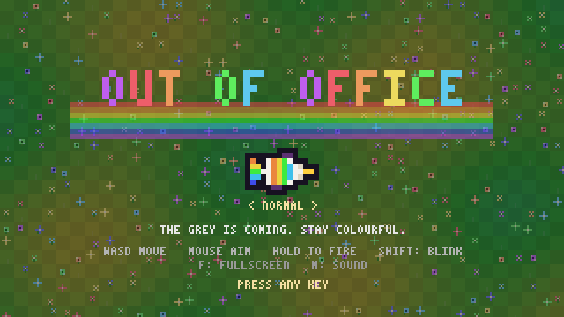
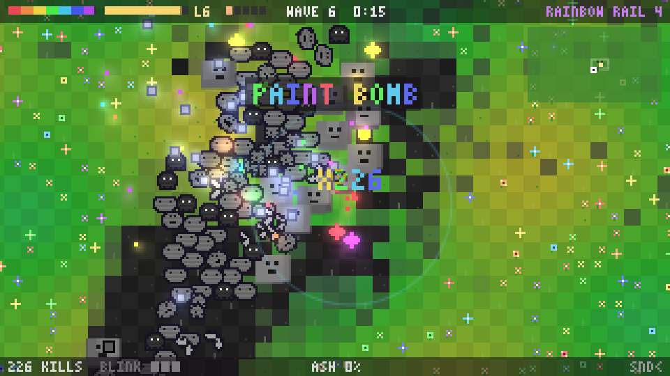
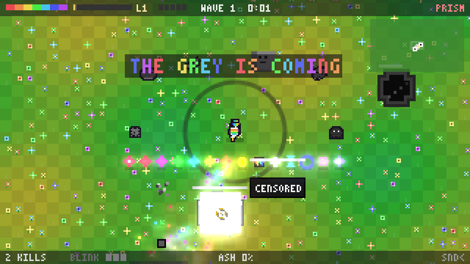
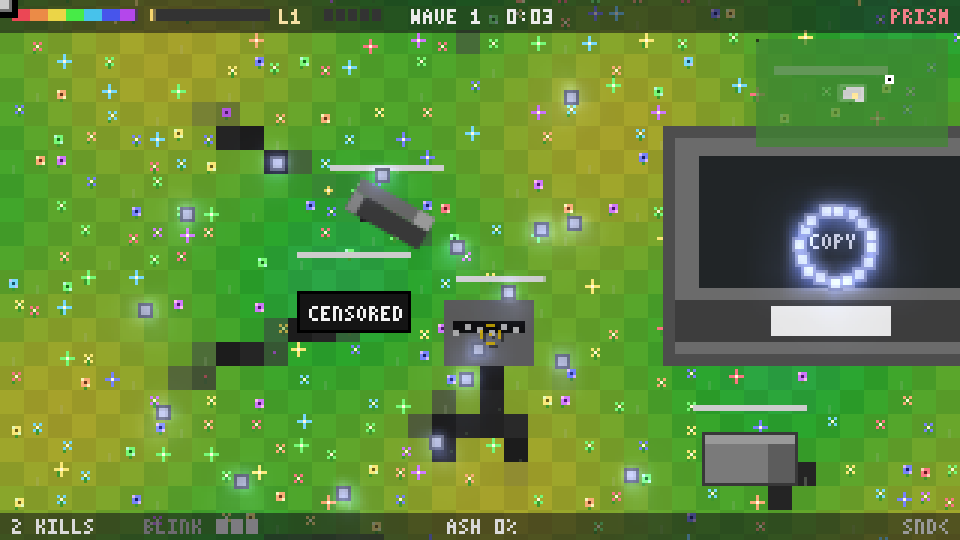
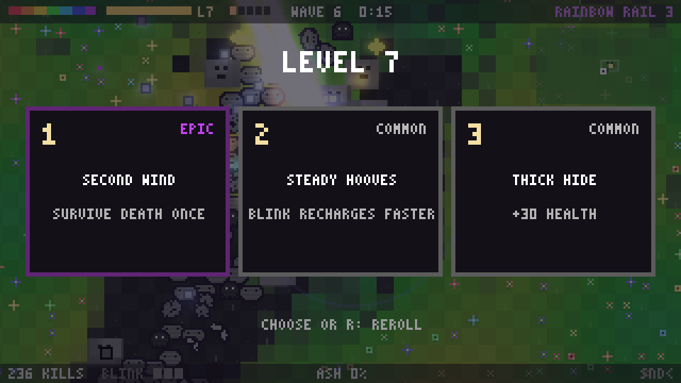
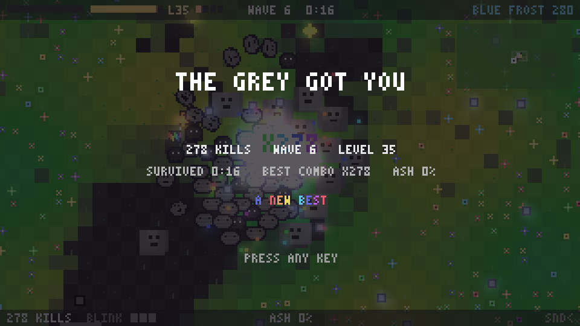

# OUT OF OFFICE

*The grey is the office. The bosses are its supplies. The goal is to be out of it.*

A [js13kGames](https://js13kgames.com) 2026 entry for the theme *Unicorns and
Rainbows*: a top-down arena survival shooter, with a unicorn. One HTML file under **13,312 bytes zipped**, no image, audio or font
assets. Every pixel, note and word is generated from code at runtime.

## Screenshots

| | |
|---|---|
|  |  |
| **Title.** The name in the 3x5 font, the rearing unicorn at three times size, the bow behind. | **The horde.** Wave 6, a few hundred of the grey walking in from the wells, bloom on every shot. |
|  |  |
| **The zoo.** Every kind of grey, every pickup, a foal and an inkwell in one view. | **The office.** All six bosses at once: censor, eraser, stapler, stamp, shredder and the photocopier. |
|  |  |
| **Perks.** Three cards a level, each with its own rarity roll. | **Game over.** Kills, wave, level, time, best combo and how much of the field went to ash. |

## Building

    npm install
    npm run dev      # writes dev.html; open it in a browser, breakpoints land in real files
    npm run size     # per-module byte report
    npm run pack     # Terser + Roadroller + zip + advzip, checked against 13,312
    npm test         # headless: build with a test handle, play a scripted minute under node-canvas
    npm run shots    # rewrite screenshots/*.png from the packed build
    npm run sim      # a bot plays whole games headlessly and prints the difficulty curve

The packed entry is `dist/index.html`; `dist/game.zip` is the submission.
`advzip` (from advancecomp, `brew install advancecomp`) is optional and worth
about 400 bytes; the build says which zipper it used. Current pack: **13,306 B**,
6 under the limit.

`npm run sim` plays three five-minute games with a bot that kites, blinks
when surrounded, chases pickups and picks perks by a priority list, and prints
where health, kills and the horde stood at every wave; `node tools/sim.js
--games 5 --minutes 8 --wave 10 --policy random` changes the run.

## The idea

**The Grey is coming.** Everything that climbs out of the inkwells is grey,
and it eats colour: every step a grey thing takes drains the ground under it.
You are a unicorn whose horn is a prism, and every shot is a rainbow. Kill
things and the colour they were holding bursts back into the meadow.

Three things make it more than a horde shooter with a horse:

- **The meadow is a resource.** It is a grid of colour. Where the grey walks
  it leaves black ash, and ash is bad ground: *you* move at half speed on it
  and everything grey moves a third faster, so a drained patch is a trap that
  closes. Kills and dying shots repaint it. **ASH** in the HUD is how much of
  the field has gone.
- **Dispersion is the default weapon.** The **PRISM** fires seven bullets, one
  per band, and each band has its own speed, so every volley fans out into a
  rainbow with distance, exactly like light through glass. Red is slow and
  close, violet is fast and far. Prism pickups shift the horn to one band with
  its own behaviour, and when the ammo runs out you are back to the PRISM.
- **The bosses are office supplies.** Every fifth wave one walks in from a
  rota of five, and every fortieth wave *the photocopier* arrives on top.
  From wave 30 they come in pairs, from 60 in threes.

## The grey

Waves last thirty seconds. Each new kind is announced when it first appears.
The difficulty picked on the title scales enemy health and spawn counts: EASY
is 0.7, NORMAL 1, HARD 1.4.

| Kind | Wave | What it does |
|---|---|---|
| **DRAB** | 1 | walks at you, in numbers |
| **MOTH** | 2 | fast and never in a straight line |
| **SPITTER** | 3 | keeps its distance and spits grey that greys the ground where it lands |
| **SMUDGE** | 4 | slow, tough, spits a fan of three, splits into three drabs |
| **BLOT** | 4 | tiny; dies into a splat that drains the ground under it, so kill it at range |
| **SHADE** | 6 | fast on ash, slow on colour: it wants the world grey |
| **STATIC** | 8 | blinks to somewhere near you every two seconds and fires on arrival |

| Boss | Wave | What it does |
|---|---|---|
| **CENSOR** | 5 | a black bar that says CENSORED; fires rings of ink and tries to cover you |
| **ERASER** | 10 | charges across the meadow in straight lines, rubbing out a lane; shoots a fan |
| **STAPLER** | 15 | opens its jaw, lunges, fires a pair of staples |
| **STAMP** | 20 | marks the spot you stand on, lifts, and slams down there: VOID |
| **SHREDDER** | 25 | pulls you in and feeds out strips, which are moths |
| **PHOTOCOPIER** | 40 | gigantic; rings of sixteen, and every four seconds it scans and copies eight drabs off its edge |

Bosses scale with the wave, ignore the horde cap, die to a chord and a crash
in the music's key, and drop gold, a paint bomb and a prism. Their deaths have lines: *UNCENSORED*, *RUBBED OUT*, *UNSTAPLED*,
*RETURN TO SENDER*, *PAPER JAM*, *OUT OF TONER*.

**Inkwells** are where the grey comes from: every spawn burst climbs out of
one. A well is a dark hole of ink that opens out of your sight, 260 to 600 px
away (the first one opens on screen, so you learn where the grey comes from).
It bleeds the colour out of the ground around it, has health, blocks you,
shows on the map and gets an edge marker when it is near. Shoot one dry and
the colour floods back with gold and another pickup on top, and the flow from
it stops. One opens every wave, up to ten, each tougher than the last; if none
is left another opens within four seconds, and only with no well at all does
the grey come in from the screen edge. The grey walks from the wells to you,
so the ash trails on the map show you where they are.

The world is eight screens wide and eight tall, the floor of a pit whose
walls lean away from you at the edges. Up to **a thousand** of the grey are
alive at once. A map in the corner shows the world at one in forty, painted
with the meadow itself so the ash shows, with the wells, the bosses, you and
the view.

## The unicorn

**Prisms.** REDSHIFT (a hose), RAINBOW RAIL (an instant beam through everything, all seven bands wide), GREEN GOO
(puddles), BLUE FROST (slows), YELLOW ARC (chain lightning), ORANGE BURST
(shotgun). Each comes with its own ammo.

**Pickups** drop from kills: hearts, the six prisms, GOLD (experience), PAINT
BOMB (repaints a wide circle), NOVA (kills everything in view), HOURGLASS (the
grey nearly stops for six seconds), SHIELD (seven seconds of invulnerability),
SUGAR RUSH (double fire rate for nine seconds) and SHARDS. The strong ones are
on a clock whatever your luck: one of nova, hourglass, shield or sugar rush
every twenty seconds at most, a heart every four. Shards always drift to you,
and five of them make **WHITE LIGHT**: eight seconds of every band at once,
three times the fire rate, shots that pierce three more, invulnerability and a
horn that tramples.

**Blink.** Shift, Q, E or the right mouse button teleports you a short way in the direction you are
moving (or facing), straight through the grey, with a moment of
invulnerability. Three charges, one back every two and a half seconds; the
BLINK pips in the bottom bar show them.

**Perks** come three at a time on every level, and R rerolls them once. Each
card rolls its own rarity, common half the time and legend one in fifty, and the
card is coloured to match. Thirty-six perks over five shelves:

- **Common**, stackable numbers: GALLOP, THICK HIDE, HORN OF PLENTY,
  SUPERNUMERARY, HARD LIGHT, LONG SHOT, A SNACK, LUCKY HORSESHOE, STEADY
  HOOVES (the blink recharges faster).
- **Uncommon**, a new rule: POT OF GOLD, MEADOW REGEN, SHARP HORN, GLITTER
  HOOVES, SURE FOOTED, BLOOM, AMMO BELT, BRIGHT EYES (every enemy on the map),
  HOARDER (four shards make WHITE LIGHT), LONG BLINK (half again as far).
- **Rare**, the sky: DOUBLE RAINBOW (shots bounce), ALEXANDER'S BAND (the dark
  ring between the bows slows what is near), A FOAL (up to two follow you and
  shoot), FROSTBITE, PIERCING LIGHT, MIRROR (every volley also fires
  backwards), FLASH STEP (the blink burns what it crosses).
- **Epic**: SECOND WIND, FULL SPECTRUM (every eighth volley is a ring),
  THUNDERHEAD (kills arc lightning onward), COLOURFAST (nothing drains the
  ground near you), INKPROOF (grey spit cannot hurt you).
- **Legend**: MOONBOW (night falls, the grey is slower for good), PRISM HEART
  (ammo never runs out), COMET TAIL (your trail is a rainbow that burns),
  OVERTIME (waves last forty seconds, so the bosses come later and every wave
  pays more), END OF THE RAINBOW (a hundred health and all the gold).

**Detail.** Everything that shines blooms, enemies flash when hit, a boss
death and a nova freeze the frame for a beat, kills within a second and a half
chain into a combo that multiplies experience, off-screen bosses get a
blinking marker at the edge, the HUD keeps a survival clock, and hooves kick
up dust. Health is a rainbow too: seven bars, one per band, red goes last.

**Achievements.** Twelve, checked twice a second, announced when they unlock,
kept in localStorage and counted on the title screen: a hundred kills, a
thousand, ten thousand, a boss, five bosses, X50, wave ten, wave twenty, WHITE
LIGHT, a legend perk, wave three untouched, five minutes with the field under
5% ash.

## How to play

Keyboard and mouse only.

| | |
|---|---|
| **Move** | WASD or arrows |
| **Aim and fire** | the mouse; hold the button |
| **Blink** | Shift, Q, E or the right mouse button |
| **Pause** | P or Escape |
| **Perks** | click a card; R rerolls the three, once a level |
| **Fullscreen** | F |
| **Difficulty** | left and right on the title: EASY, NORMAL, HARD |
| **Sound** | M, or the SND label in the corner |

## Art and sound

**Sprites** are strings, one character per pixel, and a palette is a function
of the character and its position: the mane is seven hues by column, the tail
seven hues by row. The unicorn is seen from above, rearing: head and
shoulders, the forehooves up at its sides, the horn forward. Every sprite is
baked once with a one-pixel dark rim underneath, so it reads on any ground,
and rotates to the aim with nearest-neighbour sampling to stay chunky.

**The meadow** is 320 by 180 cells of drifting greens, each holding a
saturation value that the game reads as colour and draws as lightness and
saturation together, so a drained cell is flat ash. A third of the cells hold
a flower of one of three species, growing from a sprout to a bud to a bloom
that sways, as fast as the colour of its cell allows, trampled flat by
anything that walks on it (hooves send petals flying) and back in about a
second.

**Bloom.** Fire and only fire: shots, the muzzle flash, sparks, explosions
(every kill leaves a burst that lives only in the glow layer; bosses, novas,
paint bombs and dry wells leave big ones), hit flashes, pickups and the grey's
spit (a cold ink blue, so it can be dodged) are drawn a second time onto a
glow canvas, which is shrunk to a quarter, an eighth and
a sixteenth of the screen with bilinear sampling (the shrink is the blur) and
added back over the frame with the `lighter` composite. Three small canvases
and five drawImage calls a frame; the grey and the unicorn never touch the
glow layer, so they stay flat while the colour burns.

**Crowds.** Every tick, every enemy goes into a spatial hash: the world is cut
into 16 px cells and each cell keeps a linked list of what is in it as two
Int32Arrays (a head index per cell, a next index per enemy), so rebuilding it
is a thousand stores with no allocation. Separation, bullets, goo and the
blink then look at nine cells instead of at everyone; a full tick with a
thousand alive costs about a millisecond. A uniform grid wins over a quadtree
here because everything is about the same size, spread evenly and moves every
tick, so a tree would be rebuilt every tick for nothing.

**Music** is one tracker with patterns as strings, scheduled a third of a
second ahead. The beat is a gallop: 12/8, three steps to a beat,
soft-soft-HARD on the kick. The chords go Am F C G, a bar each: the bass
plucks the root through a filter that closes, the pad is six detuned saws that
duck under the kick, the arpeggio runs the chord tones through a feedback
delay, and the lead is a four-bar tune on the minor pentatonic in twin
detuned squares. Everything runs through a compressor and a reverb made from
a second and a half of decaying noise; the snare, hats and crash are the same
second of noise through filters. A voice joins every few waves so the arena
gets louder as it gets worse, with a snare fill every fourth bar and a crash
after it; the drums drop out for the first two seconds of every wave and crash
back in; the title is the pad and the arpeggio alone.

**Sound effects** are the same voices through the same chain. Kills pop *in
key*, a pentatonic note over the bar's chord that climbs with the combo; the
hourglass halves the tempo; below 30% health a lowpass closes over everything
and the drums thin to the kick.

## Structure

`src/*.js` are concatenated in filename order into one scope: no bundler, no
imports. Top-level `const`s initialise in sequence, so the numbering is the
load order. Insert new modules at a free number, never renumber.

    00_boot        canvas and context, 320x180, the glow canvases
    10_core        colour, rect, clamp, PRNG, the seven hues
    12_font        3x5 pixel font, one base-32 character per column
    14_audio       the click-to-start gate; effects are music voices through the same chain
    16_music       the gallop tracker
    20_data        enemy kinds, prisms, achievements, perks
    30_state       all mutable state, newGame
    40_sprites     pixel strings baked with a rim; rotated drawing
    50_meadow      the colour grid, the flowers, the pit walls
    60_input       keys, mouse, menus
    70_player      movement, aim, the blink, the foal, getting hurt
    72_bullets     every prism, chain lightning, goo, what the grey spits
    74_enemies     spawning, waves, seven kinds and six bosses, the spatial hash, deaths, pickups, shards, level-ups
    76_wells       inkwells: the spawners
    80_draw        world, the bloom pass and HUD
    82_screens     title, perk pick, game over
    90_loop        fixed-step loop and render

`tools/patches/` keeps two features that were built and shelved for bytes,
the speed zoom and a chromatic split on the glow, written up so they can come
back.

Conventions the build depends on: colours use the comma form
`hsla(h,s%,l%,a)` so node-canvas and the headless test agree; no element has
a single-letter id because the packer's decoder uses bare globals; every game
string is ASCII because the shell has no charset meta; only distinct code
costs bytes under Roadroller, so measure the zip and not the minified size.

## License

Apache License 2.0. Copyright 2026 Raimon Ràfols.
